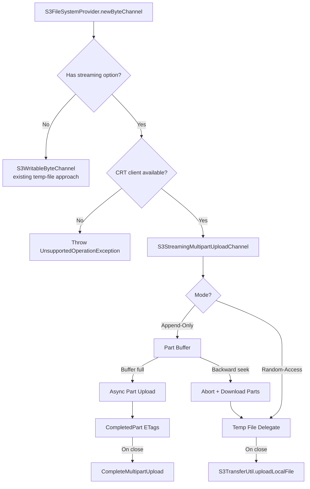
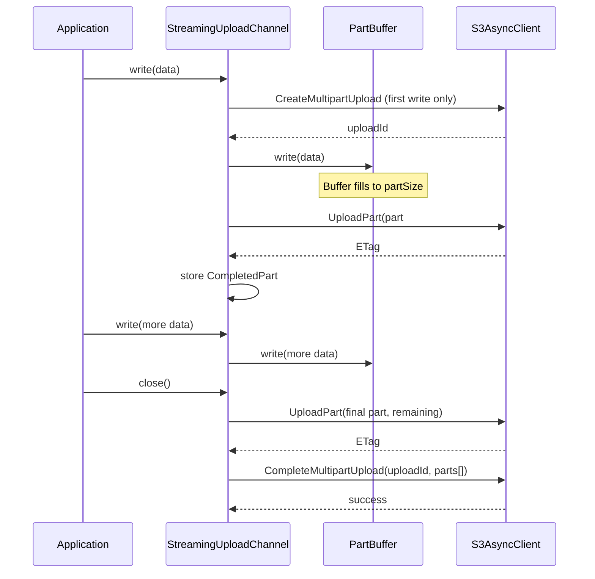
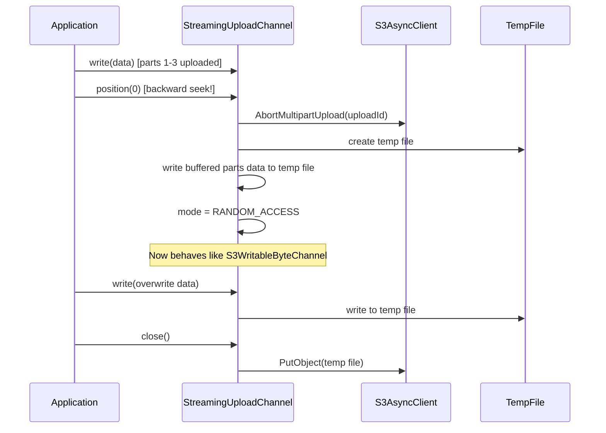
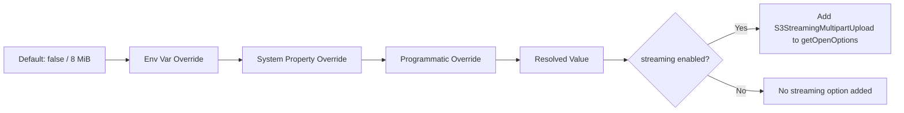

# Design Document: Streaming Multipart Upload

## Overview

This design introduces a streaming multipart upload capability to the AWS Java NIO SPI for S3 library. The current write path (`S3WritableByteChannel`) buffers all written data to a local temporary file and uploads it as a single object on `close()`. This is inefficient for large files because:

1. It requires local disk space equal to the full object size
2. No data reaches S3 until the channel is closed
3. A failure at close time loses all progress

The streaming multipart upload feature uploads parts to S3 incrementally as data is written, using S3's multipart upload API. This reduces memory/disk pressure and provides incremental progress. The feature operates in two modes:

- **Append-Only Mode**: Data is uploaded in parts as it arrives (default when writes are sequential)
- **Random-Access Mode**: Falls back to the existing temp-file approach when a backward seek is detected

The feature requires the AWS CRT client for high-performance multipart operations and is activated via a new `S3OpenOption`.

## Architecture



### High-Level Flow

1. User opens a channel with `S3OpenOption.streamingMultipartUpload()`
2. `S3SeekableByteChannel` detects the option and creates an `S3StreamingMultipartUploadChannel` as the write delegate
3. On first write, `CreateMultipartUpload` is called to initiate the session
4. Bytes accumulate in a `PartBuffer` until the configured part size is reached
5. Full buffers are uploaded asynchronously as numbered parts
6. On `close()`, remaining bytes are flushed as the final part and `CompleteMultipartUpload` is called
7. If a backward seek occurs, the channel aborts the multipart session, reconstructs a local temp file, and delegates to the existing upload-on-close behavior

## Components and Interfaces

### New Classes

#### `S3StreamingMultipartUpload` (extends `S3OpenOption`)

The open option that activates streaming multipart upload behavior.

```java
class S3StreamingMultipartUpload extends S3OpenOption {
    static final long MIN_PART_SIZE = 5 * 1024 * 1024;        // 5 MiB
    static final long MAX_PART_SIZE = 5L * 1024 * 1024 * 1024; // 5 GiB
    static final long DEFAULT_PART_SIZE = 8 * 1024 * 1024;     // 8 MiB
    static final int MAX_PARTS = 10_000;
    static final int DEFAULT_MAX_IN_FLIGHT = 4;

    private final long partSize;
    private final int maxInFlight;

    // Factory accessed via S3OpenOption.streamingMultipartUpload()
    // and S3OpenOption.streamingMultipartUpload(long partSize)
}
```

#### `S3StreamingMultipartUploadChannel` (implements `SeekableByteChannel`)

The core channel implementation that manages the multipart upload lifecycle.

```java
class S3StreamingMultipartUploadChannel implements SeekableByteChannel {
    // State
    private enum Mode { APPEND_ONLY, RANDOM_ACCESS }
    private Mode mode = Mode.APPEND_ONLY;
    private boolean open = true;
    private long position = 0;
    
    // Multipart upload state
    private String uploadId;
    private int nextPartNumber = 1;
    private final List<CompletedPart> completedParts = new ArrayList<>();
    private ByteBuffer currentBuffer;
    
    // Backpressure
    private final Semaphore inFlightPermits;
    private final Queue<CompletableFuture<CompletedPart>> inFlightUploads;
    
    // Fallback
    private S3WritableByteChannel fallbackChannel;
    
    // Key methods
    int write(ByteBuffer src);
    SeekableByteChannel position(long newPosition);
    void close();
    void force();
}
```

#### `PartBuffer`

Internal helper that manages the byte buffer for accumulating part data.

```java
class PartBuffer {
    private ByteBuffer buffer;
    private final long partSize;
    
    int write(ByteBuffer src);  // Returns bytes written
    boolean isFull();
    ByteBuffer flip();          // Prepare for upload
    int remaining();
}
```

### Modified Classes

#### `S3OpenOption`

Add factory methods:

```java
public static S3OpenOption streamingMultipartUpload() {
    return new S3StreamingMultipartUpload(
        S3StreamingMultipartUpload.DEFAULT_PART_SIZE,
        S3StreamingMultipartUpload.DEFAULT_MAX_IN_FLIGHT
    );
}

public static S3OpenOption streamingMultipartUpload(long partSize) {
    if (partSize < S3StreamingMultipartUpload.MIN_PART_SIZE) {
        throw new IllegalArgumentException(
            "Part size must be at least 5 MiB, got: " + partSize);
    }
    if (partSize > S3StreamingMultipartUpload.MAX_PART_SIZE) {
        throw new IllegalArgumentException(
            "Part size must not exceed 5 GiB, got: " + partSize);
    }
    return new S3StreamingMultipartUpload(partSize,
        S3StreamingMultipartUpload.DEFAULT_MAX_IN_FLIGHT);
}
```

#### `S3SeekableByteChannel`

Modify the constructor to detect the streaming multipart upload option and create an `S3StreamingMultipartUploadChannel` as the write delegate instead of `S3WritableByteChannel`:

```java
if (options.contains(StandardOpenOption.WRITE)) {
    if (hasStreamingMultipartOption(options)) {
        validateCrtClient(s3Client);
        writeDelegate = new S3StreamingMultipartUploadChannel(s3Path, s3Client, options);
    } else {
        writeDelegate = new S3WritableByteChannel(s3Path, s3Client, transferUtil, options);
    }
}
```

### Interaction Sequence



### Fallback Sequence



## Data Models

### Multipart Upload State

| Field | Type | Description |
|-------|------|-------------|
| `uploadId` | `String` | S3 multipart upload ID, null until first write |
| `nextPartNumber` | `int` | Next part number to assign (starts at 1) |
| `completedParts` | `List<CompletedPart>` | ETags and part numbers of uploaded parts |
| `mode` | `Mode` | Current mode: APPEND_ONLY or RANDOM_ACCESS |
| `position` | `long` | Current write position (total bytes written) |
| `currentBuffer` | `ByteBuffer` | Active part buffer being filled |
| `partSize` | `long` | Configured part size in bytes |
| `maxInFlight` | `int` | Maximum concurrent part uploads |

### CompletedPart

```java
record CompletedPart(int partNumber, String eTag) {}
```

Maps directly to `software.amazon.awssdk.services.s3.model.CompletedPart` from the AWS SDK.

### Configuration Constants

| Constant | Value | Description |
|----------|-------|-------------|
| `MIN_PART_SIZE` | 5 MiB (5,242,880 bytes) | S3 minimum part size |
| `MAX_PART_SIZE` | 5 GiB (5,368,709,120 bytes) | S3 maximum part size |
| `DEFAULT_PART_SIZE` | 8 MiB (8,388,608 bytes) | Default part size |
| `MAX_PARTS` | 10,000 | S3 maximum parts per upload |
| `DEFAULT_MAX_IN_FLIGHT` | 4 | Default concurrent uploads |

## Correctness Properties

*A property is a characteristic or behavior that should hold true across all valid executions of a system — essentially, a formal statement about what the system should do. Properties serve as the bridge between human-readable specifications and machine-verifiable correctness guarantees.*

### Property 1: Part size validation accepts only valid range

*For any* long value, the `streamingMultipartUpload(partSize)` factory method SHALL accept it if and only if it is in the range [5 MiB, 5 GiB]; values outside this range SHALL cause an `IllegalArgumentException`.

**Validates: Requirements 2.3, 7.2, 7.3, 11.2**

### Property 2: Buffering threshold triggers upload at exactly part size

*For any* sequence of writes to the channel, a part upload SHALL be initiated if and only if the accumulated bytes in the current buffer reach the configured part size. The uploaded part SHALL contain exactly `partSize` bytes (except for the final part on close).

**Validates: Requirements 2.1, 2.2, 2.4**

### Property 3: Sequential part ordering

*For any* sequence of writes that produces N uploaded parts, the parts SHALL be numbered 1 through N in strictly sequential order, and the `CompleteMultipartUpload` request SHALL contain all N ETags in that same sequential order.

**Validates: Requirements 2.5, 3.5**

### Property 4: Close flushes remaining data

*For any* sequence of writes where the total bytes written is not a multiple of the part size, closing the channel SHALL upload the remaining bytes (less than part size) as the final part and complete the multipart upload session.

**Validates: Requirements 3.2, 5.1, 5.5**

### Property 5: Fallback preserves all written data

*For any* sequence of writes followed by a backward seek, the reconstructed temp file SHALL contain exactly the same bytes (in the same order) as were written to the channel before the seek occurred.

**Validates: Requirements 4.1, 4.2, 4.5**

### Property 6: Close idempotence

*For any* channel state, calling `close()` N times (N ≥ 1) SHALL produce the same observable side effects (S3 API calls) as calling `close()` exactly once.

**Validates: Requirements 5.4**

### Property 7: Position equals total bytes written

*For any* sequence of writes in append-only mode, `position()` SHALL return the sum of all bytes written, and `size()` SHALL equal `position()`.

**Validates: Requirements 10.1, 10.2**

### Property 8: Part limit enforcement

*For any* configured part size, if the total bytes written would require more than 10,000 parts, the channel SHALL throw an `IllegalStateException` before initiating the upload of the 10,001st part, and SHALL abort the active multipart upload session.

**Validates: Requirements 11.1, 11.3, 11.4**

### Property 9: Memory bound invariant

*For any* sequence of writes, the number of allocated part buffers SHALL never exceed `maxInFlight + 1`, bounding total memory consumption to approximately `(maxInFlight + 1) × partSize`.

**Validates: Requirements 6.4**

### Property 10: Configuration-driven streaming option inclusion

*For any* combination of default, environment variable, system property, and programmatic override values for `s3.spi.write.streaming-multipart-upload`, the `getOpenOptions()` method SHALL include an `S3StreamingMultipartUpload` option if and only if the resolved value is `true` (following the override precedence: default → env var → system property → programmatic). When included, the option SHALL be configured with the resolved `s3.spi.write.multipart-part-size` value.

**Validates: Requirements 14.1, 14.2, 14.3, 14.4, 14.5, 14.6, 14.7, 14.8, 14.10**

## Configuration Support for SPI Users

### Overview

SPI users (e.g., GATK, genomics pipelines) interact with S3 through standard `java.nio.file.Files` APIs and cannot pass custom `OpenOption` instances programmatically. To enable streaming multipart uploads for these users, the `S3NioSpiConfiguration` class is extended with two new properties that follow the existing configuration pattern (defaults → env var → system property → programmatic override).

### New Configuration Properties

| Property | Env Var | Type | Default | Description |
|----------|---------|------|---------|-------------|
| `s3.spi.write.streaming-multipart-upload` | `S3_SPI_WRITE_STREAMING_MULTIPART_UPLOAD` | `boolean` | `false` | Enables streaming multipart upload in default open options |
| `s3.spi.write.multipart-part-size` | `S3_SPI_WRITE_MULTIPART_PART_SIZE` | `long` (bytes) | `8388608` (8 MiB) | Part size for streaming multipart uploads |

### Changes to `S3NioSpiConfiguration`

#### New Constants

```java
/**
 * The name of the streaming multipart upload enabled property
 */
public static final String S3_SPI_WRITE_STREAMING_MULTIPART_UPLOAD_PROPERTY = "s3.spi.write.streaming-multipart-upload";
/**
 * The default value of the streaming multipart upload enabled property
 */
public static final boolean S3_SPI_WRITE_STREAMING_MULTIPART_UPLOAD_DEFAULT = false;
/**
 * The name of the multipart part size property
 */
public static final String S3_SPI_WRITE_MULTIPART_PART_SIZE_PROPERTY = "s3.spi.write.multipart-part-size";
/**
 * The default value of the multipart part size property (8 MiB)
 */
public static final long S3_SPI_WRITE_MULTIPART_PART_SIZE_DEFAULT = 8L * 1024 * 1024;
```

#### Constructor Changes

In the constructor, the two new properties are added to the defaults map before the env var / system property override loop runs:

```java
put(S3_SPI_WRITE_STREAMING_MULTIPART_UPLOAD_PROPERTY, String.valueOf(S3_SPI_WRITE_STREAMING_MULTIPART_UPLOAD_DEFAULT));
put(S3_SPI_WRITE_MULTIPART_PART_SIZE_PROPERTY, String.valueOf(S3_SPI_WRITE_MULTIPART_PART_SIZE_DEFAULT));
```

Because these properties are added to the map before the existing env var and system property override loops, they automatically participate in the standard override chain:
1. Default value set in constructor
2. Environment variable override (e.g., `S3_SPI_WRITE_STREAMING_MULTIPART_UPLOAD=true`)
3. System property override (e.g., `-Ds3.spi.write.streaming-multipart-upload=true`)
4. Programmatic override via constructor `overrides` map

#### New Getter Methods

```java
/**
 * Get whether streaming multipart upload is enabled.
 *
 * @return true if streaming multipart upload is enabled
 */
public boolean isStreamingMultipartUploadEnabled() {
    return Boolean.parseBoolean(
        (String) getOrDefault(S3_SPI_WRITE_STREAMING_MULTIPART_UPLOAD_PROPERTY,
            String.valueOf(S3_SPI_WRITE_STREAMING_MULTIPART_UPLOAD_DEFAULT)));
}

/**
 * Get the configured multipart part size in bytes.
 *
 * @return the configured part size or the default (8 MiB) if not overridden or invalid
 */
public long getMultipartPartSize() {
    return parseLongProperty(
        S3_SPI_WRITE_MULTIPART_PART_SIZE_PROPERTY,
        S3_SPI_WRITE_MULTIPART_PART_SIZE_DEFAULT);
}
```

#### New Fluent Setter Methods

```java
/**
 * Fluently sets whether streaming multipart upload is enabled.
 *
 * @param enabled true to enable streaming multipart upload
 * @return this instance
 */
public S3NioSpiConfiguration withStreamingMultipartUpload(boolean enabled) {
    put(S3_SPI_WRITE_STREAMING_MULTIPART_UPLOAD_PROPERTY, String.valueOf(enabled));
    return this;
}

/**
 * Fluently sets the multipart part size.
 *
 * @param partSize the part size in bytes
 * @return this instance
 * @throws IllegalArgumentException if partSize is less than 5 MiB or greater than 5 GiB
 */
public S3NioSpiConfiguration withMultipartPartSize(long partSize) {
    if (partSize < S3StreamingMultipartUpload.MIN_PART_SIZE) {
        throw new IllegalArgumentException("partSize must be at least 5 MiB, got: " + partSize);
    }
    if (partSize > S3StreamingMultipartUpload.MAX_PART_SIZE) {
        throw new IllegalArgumentException("partSize must not exceed 5 GiB, got: " + partSize);
    }
    put(S3_SPI_WRITE_MULTIPART_PART_SIZE_PROPERTY, String.valueOf(partSize));
    return this;
}
```

#### Modified `getOpenOptions()` Method

The `getOpenOptions()` method is updated to conditionally include the `S3StreamingMultipartUpload` option based on the configuration:

```java
public Set<S3OpenOption> getOpenOptions() {
    @SuppressWarnings("unchecked")
    var options = (Set<S3OpenOption>) getOrDefault(S3_OPEN_OPTIONS_PROPERTY, Set.of());
    // make a defensive copy to ensure that the thread-safetyness is ensured for the consumers
    var result = options.stream().map(S3OpenOption::copy).collect(Collectors.toSet());

    // Add streaming multipart upload option if enabled via configuration
    if (isStreamingMultipartUploadEnabled()) {
        result.add(S3OpenOption.streamingMultipartUpload(getMultipartPartSize()));
    }

    return result;
}
```

#### Helper Method

A `parseLongProperty` method is added (analogous to the existing `parseIntProperty`):

```java
private long parseLongProperty(String propName, long defaultVal) {
    var propertyVal = (String) get(propName);
    try {
        return Long.parseLong(propertyVal);
    } catch (NumberFormatException e) {
        logger.warn("the value of '{}' for '{}' is not a long, using default value of '{}'",
            propertyVal, propName, defaultVal);
        return defaultVal;
    }
}
```

### Override Precedence Diagram



### Integration with Existing Flow

The configuration-based activation integrates seamlessly with the existing channel creation flow:

1. `S3FileSystem.appendConfiguredOpenOptions()` calls `configuration.getOpenOptions()`
2. If streaming is enabled via config, the returned set includes `S3StreamingMultipartUpload`
3. `S3SeekableByteChannel` detects the option and creates `S3StreamingMultipartUploadChannel`
4. No code changes needed in the channel creation path — it already handles the option

This means SPI users can enable streaming multipart uploads with:
```bash
# Environment variable
export S3_SPI_WRITE_STREAMING_MULTIPART_UPLOAD=true
export S3_SPI_WRITE_MULTIPART_PART_SIZE=16777216  # 16 MiB

# Or system property
java -Ds3.spi.write.streaming-multipart-upload=true \
     -Ds3.spi.write.multipart-part-size=16777216 \
     -jar my-application.jar
```

## Error Handling

### Error Categories

| Error | Trigger | Response |
|-------|---------|----------|
| `UnsupportedOperationException` | Streaming option without CRT client | Thrown at channel creation |
| `IllegalArgumentException` | Invalid part size or READ + streaming | Thrown at option creation or channel creation |
| `IllegalStateException` | Part limit (10,000) exceeded | Abort session, throw on write |
| `IOException` | Part upload failure | Abort session, propagate on next write/close |
| `IOException` | CompleteMultipartUpload failure | Attempt abort, then throw |
| `IOException` | Timeout during part upload | Retry once, then abort and throw |

### Cleanup Strategy

1. **Normal close**: `CompleteMultipartUpload` finalizes the upload
2. **Error during upload**: `AbortMultipartUpload` cleans up incomplete parts
3. **JVM shutdown**: Shutdown hook calls `AbortMultipartUpload` if session is active
4. **Abort failure**: Log warning with upload ID for manual cleanup

### Retry Policy

- Part upload timeout: retry once with the same part data
- All other failures: no retry, abort immediately
- `AbortMultipartUpload` failure: log and continue (best-effort cleanup)

## Testing Strategy

### Property-Based Tests (JUnit 5 + jqwik)

The project will use [jqwik](https://jqwik.net/) as the property-based testing library, which integrates with JUnit 5 and is the standard PBT library for Java.

Each property test will:
- Run a minimum of 100 iterations
- Be tagged with a comment referencing the design property
- Use `@Property(tries = 100)` annotation

**Property tests to implement:**

1. **Part size validation** — Generate random longs, verify acceptance/rejection based on [5 MiB, 5 GiB] range
2. **Buffering threshold** — Generate random write sequences, verify uploads trigger at exactly part size
3. **Sequential part ordering** — Generate multi-part write sequences, verify part numbers are 1..N
4. **Close flushes remaining** — Generate writes where total % partSize ≠ 0, verify final part upload
5. **Fallback data preservation** — Generate writes + backward seek, verify temp file content matches
6. **Close idempotence** — Generate writes, close multiple times, verify single set of API calls
7. **Position tracking** — Generate write sequences, verify position() == sum of bytes written
8. **Part limit enforcement** — Generate writes exceeding 10,000 parts, verify exception
9. **Memory bound** — Generate rapid writes, verify buffer count ≤ maxInFlight + 1
10. **Configuration-driven streaming option** — Generate combinations of env var, system property, and programmatic overrides; verify `getOpenOptions()` includes streaming option iff resolved value is `true`

Tag format: `// Feature: streaming-multipart-upload, Property {N}: {description}`

### Unit Tests (JUnit 5 + Mockito)

Unit tests cover specific examples, edge cases, and error conditions:

- Channel creation with/without CRT client
- Channel creation with READ option (error case)
- First write initiates multipart session
- Close without writes does not initiate session
- Error during upload triggers abort
- Fallback logs warning message
- force() completes session and starts new one
- Shutdown hook registration
- Timeout retry behavior
- Option combinations (assumeObjectNotExists, CREATE_NEW, useTransferManager)

### Integration Tests (Testcontainers + LocalStack)

Integration tests verify end-to-end behavior against a real S3-compatible service:

- Write a multi-part object and read it back
- Verify object content matches written data
- Verify fallback produces correct object
- Verify concurrent uploads work correctly
- Verify backpressure behavior under load
